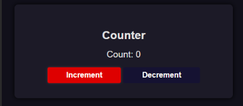
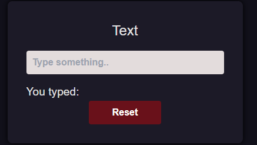
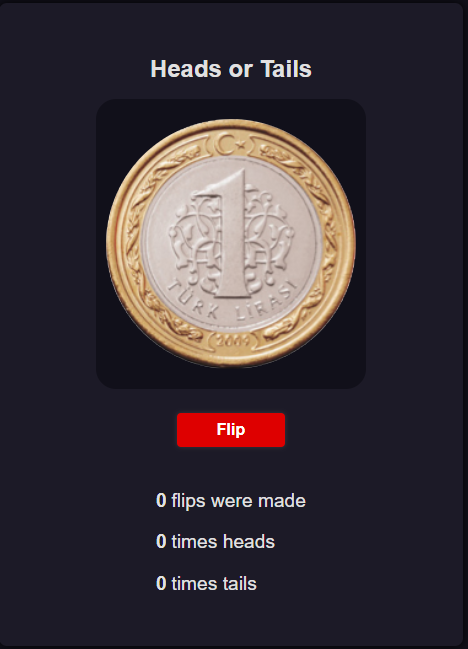
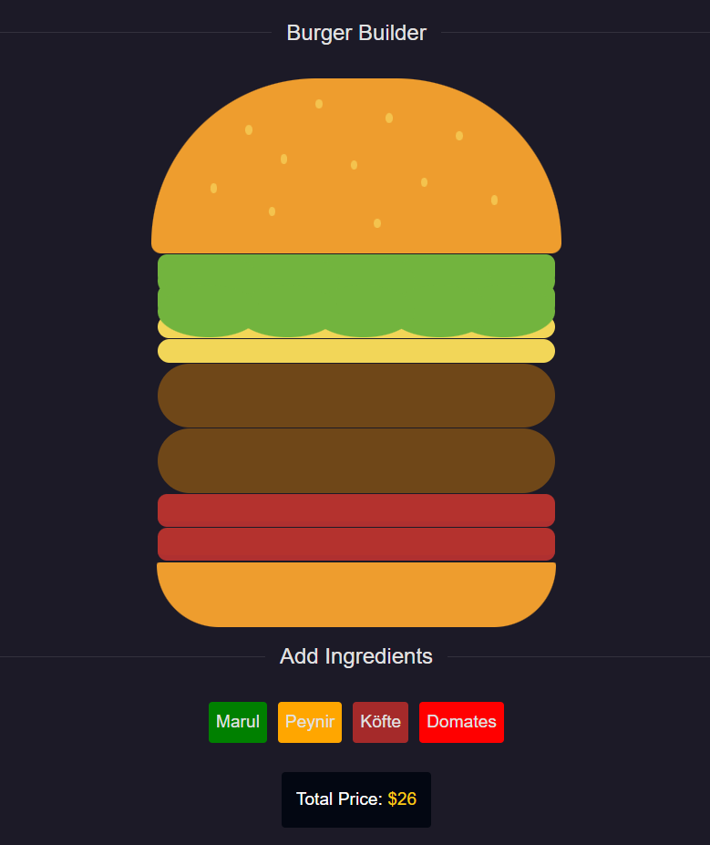

## Week - 1
Açıkama.

## Week - 2
Açıklama

## Week-3 -> Applications 
### React + Vite + TailwindCSS

#### Bileşenler

Bu projede Week 3 için dört ana bileşen bulunmaktadır. Her biri, belirli bir işlevselliği temsil eder ve projenin genel işleyişine katkıda bulunur. Aşağıda her bir bileşenin detayları yer almaktadır:

##### 1. Counter (Sayaç)

- **Başlık**: Counter
- **Açıklama**: Bu bileşen, bir sayaç işlevselliği sunar. Kullanıcılar, belirli bir sayıyı artırabilir veya azaltabilir, useState örneği için iyi bir örnektir.
- **Endpoint**: [/counter](/counter)

##### 2. Text (Metin)

- **Başlık**: Text
- **Açıklama**: Metin bileşeni, kullanıcıların metin girişi yapmasına olanak tanır. Bu bileşen, yukarda yazılam metni aşağıda çıktı olarak verir, useState örneği için iyi bir örnektir.
- **Endpoint**: [/use-state-text](/use-state-text)

##### 3. Coin Flip (Yazı Tura)

- **Başlık**: Coin Flip
- **Açıklama**: Yazı tura bileşeni, rastgele bir yazı tura oyunu sunar.
- **Endpoint**: [/coin-flip](/coin-flip)

##### 4. Burger Application (Burger Uygulaması)

  

- **Başlık**: Burger Application
- **Açıklama**: Burger uygulaması bileşeni, kullanıcıların özelleştirilebilir burgerler oluşturmasına imkan tanır. Bu bileşen, çeşitli malzemeler sunar, dinamik olarak ekler ve fiyatını hesaplar.
- **Endpoint**: [/burger-application](/burger-application)
